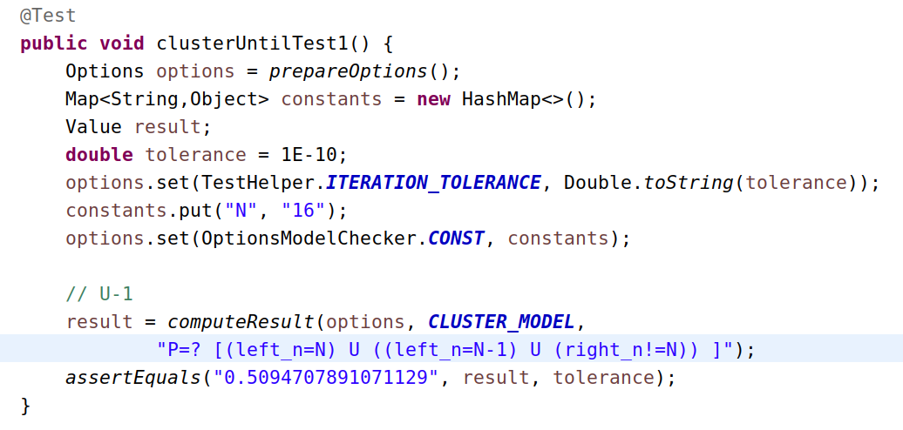
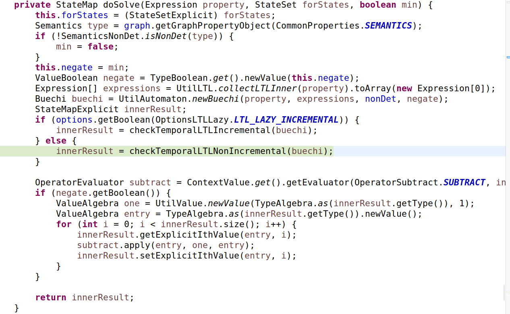
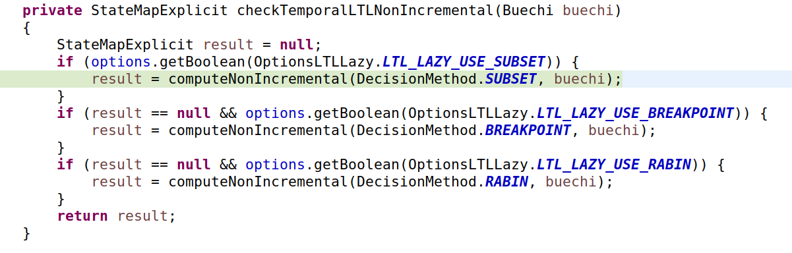
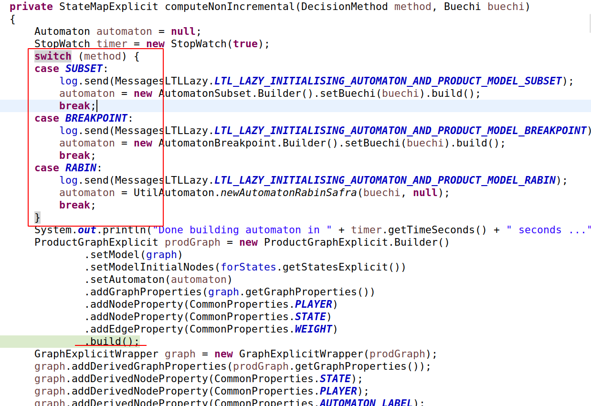
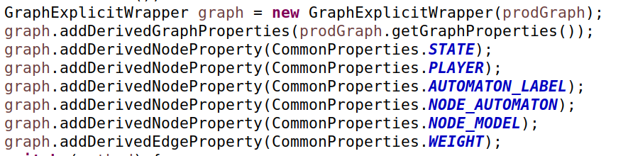
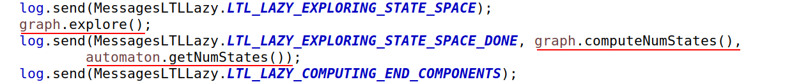
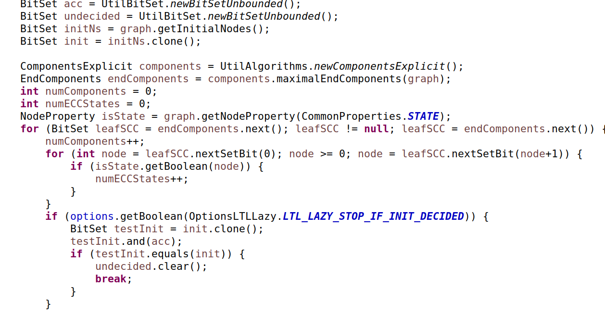
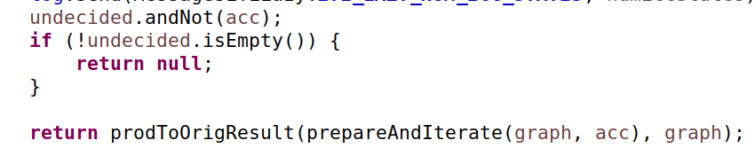

# LTL 使用GrapProduct的示例
## Test 中示例代码

## 使用Solver:PropertySolverExplicitLTLLazy

## 调用PropertySolverExplicitLTLLazy.checkTemporalLTLNonIncremental

## 调用 PropertySolverExplicitLTLLazy.computeNonIncremental

```
    1. 红框 switch case 可以扩展
    2. build 得到ProductGraph对象
```
## 构造用于计算的Graph
### Product
```
    根据ProductGraph构造结果GraphExpliciteWrapper
        这里可能包括Product的过程
```

### ResultGraph
```
    1. 对Graph 的空间进行 explore [比较耗时]
    2. 计算Graph的NumStates [比较耗时]
```

### Decide?
```
    好像是在做可判定性的判断
```

### IterateGraph
```
    迭代得到结果 (一个值)
```



